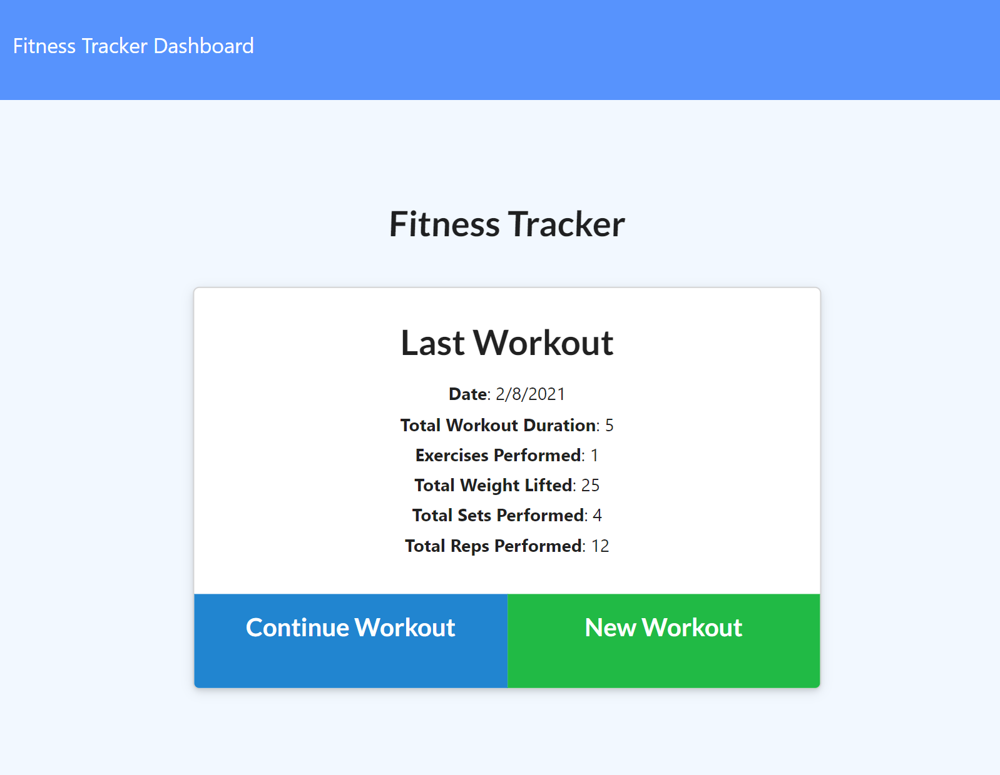
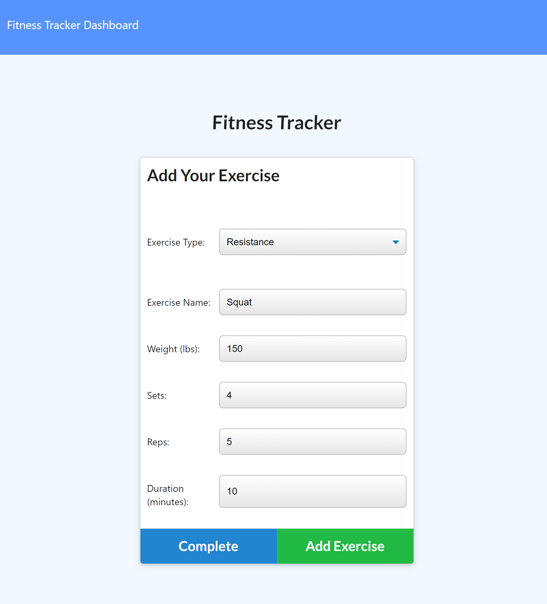
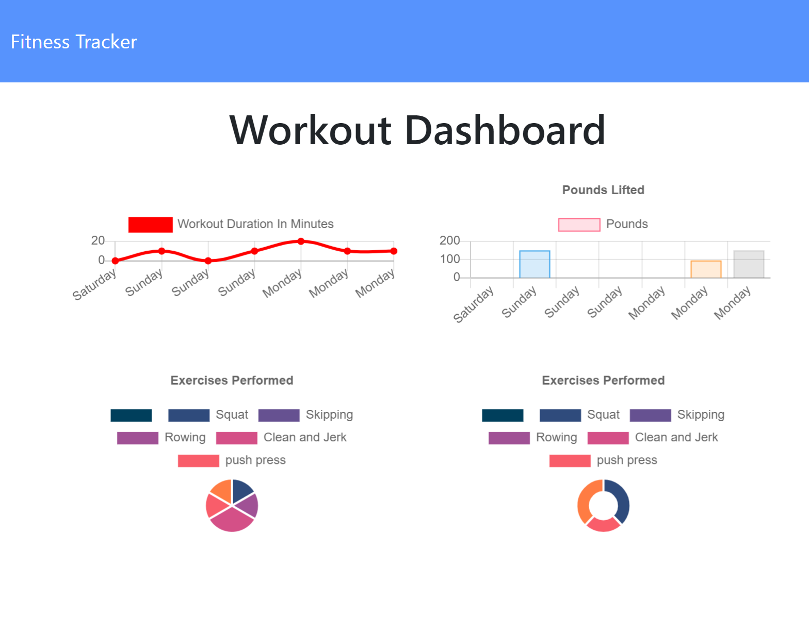

# Workout_Tracker

## Discription:

Workout Tracker is a full stack application that uses mongoDB as the database to store a user's workouts and exercises. The application provides different types of functionality that will allow the user to track new exercises in an exsisting workout, add new workouts and exercises as well as view workout time durations and totalled weights of their workouts. The front end was provided as starter code and our task was to connect the front end to MongoDB in order to store user's workouts and access them later on.

## Table of Contents

- [Usage](#usage)
- [Installation](#installation)
- [Screenshot](#screenshot)
- [Skills](#skills)
- [License](#license)
- [Resources](#resources)

## Usage

Usage of this app is for any person interested in tracking their workouts to help them stay motivated to reach their fitness goals. 

## Installation

Users may access the application via the site below:
https://young-hollows-54459.herokuapp.com/?id=60299990c77f2f00155f926e

Users or other programmers can download the repo to their own machine. Be sure to run "npm i" to pull down required packages. MongoDB will also need to be installed if not already. 

## Screenshot

## Skills

## License

License Documentation: (https://opensource.org/licenses/AFL-3.0)

## Resources
* Week 17 class activities
* Stack overflow
* https://docs.mongodb.com/manual/
* https://mongoosejs.com/docs/guide.html

 ## Questions
  * If you have any questions please feel free to email me or stop by on my GitHub! 
  * Find me on GitHub: (https://github.com/dbailey11/)
  * Email me: baileydevyn19@gmail.com